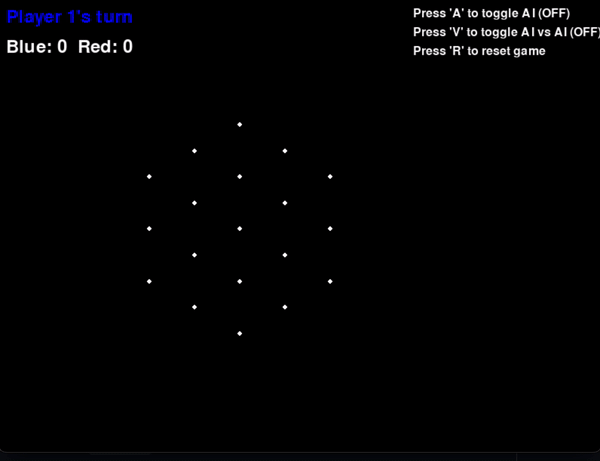

# Functional Triggle Game



Inspired by:
- [TikTok Demo](https://www.tiktok.com/@games4two/video/7318533546954509611?lang=en)
- [Physical Game on Amazon](https://www.amazon.com/Triangle-Triggle-Rubber-Strategy-Players/dp/B0D9638ZHR)

## How to Play
* Claim triangles by drawing lines between points
* First player to claim a majority of triangles wins
* Lines must go through one of the points's neighbors and cannot overlap existing lines
* If your line is invalid it won't be placed. Try again!
* Press 'A' to toggle AI
* Press 'V' to toggle AI vs AI
* Press 'R' to reset game

## Getting Started
1. Clone the repo
2. Install dependencies:
   ```bash
   pip install -r requirements.txt
   ```
3. Run the script:
   ```bash
   python renderer.py
   ```
4. Have fun!

## TODO
- [ ] Experiment with playing AI against itself, right now with some randomness given the same minimax score, player 1 or 2 wins. Look into trying it a bunch of times and see if there is a clear winner, player 1 or 2 given the same policy.
- [ ] Optimize game engine to allow for better search and porting to OpenAI Gym
- [ ] Add alpha beta pruning
- [ ] Try out MCTS
- [ ] Port to online to play with friends
- [ ] Add new game with more players
- [ ] Add new game mode with different rules:
  - Line length must be 4
  - Some triangles are worth more points
  - Some points are removed from the grid
  - Can wait for moves but you will be penalized
  - Straight lines can be 4 but can place bent lines of size 2
  - Different grid sizes and shapes
